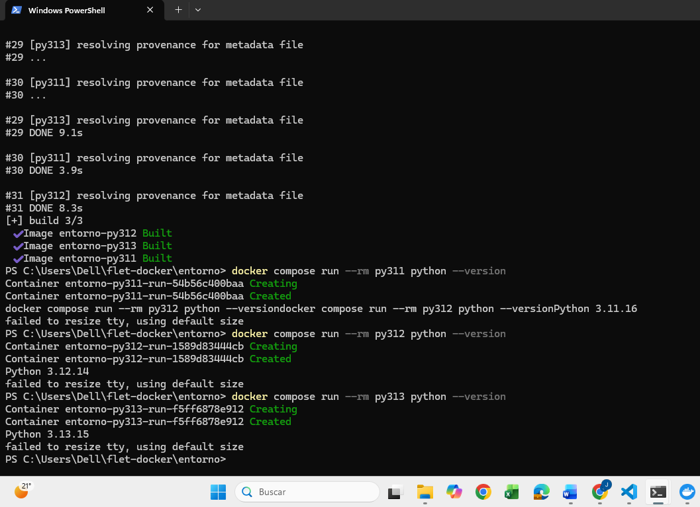

# Ejercicio 1. Entorno de trabajo

## Parte C. Los tres entornos de Python

Para comprobar que la aplicación funciona correctamente en distintas versiones de Python, se configuraron tres contenedores mediante Docker Compose, cada contenedor utiliza una versión diferente de Python y cuenta con su propio entorno virtual ubicado en `/opt/venv`.

Los entornos utilizados fueron los siguientes:

| Servicio | Imagen base | Versión obtenida |
|---|---|---|
| py311 | python:3.11-slim | Python 3.11.16 |
| py312 | python:3.12-slim | Python 3.12.14 |
| py313 | python:3.13-slim | Python 3.13.15 |

---

## Dockerfile

Para crear los tres entornos se utilizó un solo Dockerfile parametrizado:

```dockerfile
ARG PYTHON_VERSION=3.12
FROM python:${PYTHON_VERSION}-slim

RUN python -m venv /opt/venv
ENV PATH="/opt/venv/bin:$PATH"

WORKDIR /app

COPY requirements.txt .
RUN pip install --no-cache-dir --upgrade pip \
&& pip install --no-cache-dir -r requirements.txt

COPY . .

ENV FLET_FORCE_WEB_SERVER=true
ENV FLET_SERVER_PORT=8550

CMD ["python", "src/app.py"]
```

### Explicación del Dockerfile

`ARG PYTHON_VERSION=3.12`

Define un argumento llamado `PYTHON_VERSION`. Su función es permitir que la versión de Python cambie al construir cada contenedor sin tener que crear un Dockerfile diferente.

`FROM python:${PYTHON_VERSION}-slim`

Establece la imagen base de Python. El valor de `PYTHON_VERSION` se sustituye por 3.11, 3.12 o 3.13 dependiendo del servicio. Se utiliza la variante `slim` porque contiene los elementos necesarios para ejecutar Python en una imagen de menor tamaño.

`RUN python -m venv /opt/venv`

Crea un entorno virtual de Python dentro del contenedor en la ruta `/opt/venv`.

`ENV PATH="/opt/venv/bin:$PATH"`

Agrega el entorno virtual al inicio de la variable `PATH`. De esta manera, los comandos `python` y `pip` utilizan automáticamente el entorno virtual creado.

`WORKDIR /app`

Establece `/app` como directorio de trabajo dentro del contenedor.

`COPY requirements.txt .`

Copia el archivo `requirements.txt` del proyecto al directorio de trabajo del contenedor.

`RUN pip install --no-cache-dir --upgrade pip`

Actualiza `pip`, que es el administrador de paquetes utilizado por Python.

`pip install --no-cache-dir -r requirements.txt`

Instala dentro del entorno virtual las dependencias especificadas en `requirements.txt`.

`COPY . .`

Copia los archivos restantes del proyecto al directorio `/app` del contenedor.

`ENV FLET_FORCE_WEB_SERVER=true`

Configura Flet para ejecutarse como servidor web.

`ENV FLET_SERVER_PORT=8550`

Establece el puerto 8550 para la aplicación web de Flet.

`CMD ["python", "src/app.py"]`

Define el comando predeterminado del contenedor. En este caso ejecuta el archivo `src/app.py`, que contiene la interfaz gráfica de la aplicación.

---

## Docker Compose

Se utilizó el archivo `entorno/compose.yml` para definir los tres servicios.

```yaml
services:
  py311:
    build:
      context: ..
      dockerfile: entorno/Dockerfile
      args:
        PYTHON_VERSION: "3.11"
    container_name: tc_p1_py311
    volumes:
      - ..:/app
    command: pytest -q

  py312:
    build:
      context: ..
      dockerfile: entorno/Dockerfile
      args:
        PYTHON_VERSION: "3.12"
    container_name: tc_p1_py312
    ports:
      - "8550:8550"
    volumes:
      - ..:/app

  py313:
    build:
      context: ..
      dockerfile: entorno/Dockerfile
      args:
        PYTHON_VERSION: "3.13"
    container_name: tc_p1_py313
    volumes:
      - ..:/app
    command: pytest -q
```

### Explicación del archivo compose.yml

`services` define los contenedores que forman parte del proyecto.

`py311`, `py312` y `py313` son los nombres de los tres servicios utilizados.

En cada servicio, `build` indica que la imagen debe construirse utilizando el Dockerfile del proyecto.

`context: ..` establece como contexto de construcción la carpeta raíz del proyecto.

`dockerfile: entorno/Dockerfile` indica la ubicación del Dockerfile utilizado para construir las imágenes.

El apartado `args` permite enviar el valor de `PYTHON_VERSION` al Dockerfile.

Para `py311` se utiliza:

```yaml
PYTHON_VERSION: "3.11"
```

Para `py312`:

```yaml
PYTHON_VERSION: "3.12"
```

Para `py313`:

```yaml
PYTHON_VERSION: "3.13"
```

De esta manera, los tres servicios utilizan el mismo Dockerfile pero se construyen con versiones diferentes de Python.

`container_name` establece un nombre específico para cada contenedor.

Los nombres utilizados fueron:

- `tc_p1_py311`
- `tc_p1_py312`
- `tc_p1_py313`

La configuración:

```yaml
volumes:
  - ..:/app
```

vincula la carpeta raíz del proyecto con `/app` dentro del contenedor. Esto permite que los archivos del proyecto estén disponibles dentro de los contenedores.

El entorno virtual se creó en `/opt/venv` y no dentro de `/app`. De esta manera, el entorno virtual no queda oculto o sustituido cuando se monta la carpeta del proyecto sobre `/app`.

En los servicios `py311` y `py313` se utiliza:

```yaml
command: pytest -q
```

Este comando permite ejecutar automáticamente las pruebas desarrolladas con pytest.

En `py312` se publican los puertos mediante:

```yaml
ports:
  - "8550:8550"
```

Esto conecta el puerto 8550 del equipo con el puerto 8550 del contenedor y permite acceder desde el navegador a la interfaz gráfica de Flet mediante `localhost:8550`.

---

## Dependencias del proyecto

Las dependencias se fijaron en el archivo `requirements.txt`:

```text
flet[web]==0.86.5
pytest==8.3.4
```

Se utilizaron versiones específicas para mantener un entorno reproducible. Esto permite que, al volver a construir los contenedores, se instalen las mismas versiones utilizadas durante el desarrollo y las pruebas.

`flet[web]` proporciona Flet y los componentes necesarios para ejecutar la interfaz gráfica como aplicación web.

`pytest` se utiliza para crear y ejecutar las pruebas automatizadas del núcleo de la aplicación.

---

## Justificación de las versiones de Python

Se seleccionaron Python 3.11, Python 3.12 y Python 3.13 con el objetivo de comprobar el comportamiento del mismo programa en tres versiones diferentes del intérprete.

Python 3.11 se utilizó como la versión más antigua de las tres seleccionadas y permite comprobar que el programa continúa funcionando en una versión anterior compatible.

Python 3.12 se utilizó como versión de referencia del proyecto. Además, el servicio `py312` es el encargado de ejecutar la interfaz gráfica desarrollada con Flet.

Python 3.13 se utilizó como una versión más reciente para comprobar que el código y las dependencias también funcionan correctamente en una versión posterior del intérprete.

La documentación de Flet establece como requisito el uso de Python 3.10 o una versión posterior, por lo que Python 3.11, 3.12 y 3.13 cumplen con el requisito.

También se consultó el calendario oficial de soporte de Python. Python 3.11 mantiene soporte de seguridad hasta octubre de 2027, Python 3.12 hasta octubre de 2028 y Python 3.13 hasta octubre de 2029. Por lo tanto, las tres versiones seleccionadas se encuentran dentro de su ciclo de soporte.

---

## Verificación de las versiones

Después de construir las imágenes se verificó la versión de Python de cada contenedor mediante los siguientes comandos:

```powershell
docker compose run --rm py311 python --version
docker compose run --rm py312 python --version
docker compose run --rm py313 python --version
```

Los resultados obtenidos fueron:

| Servicio | Versión obtenida |
|---|---|
| py311 | Python 3.11.16 |
| py312 | Python 3.12.14 |
| py313 | Python 3.13.15 |

### Evidencia de las versiones de Python



---

## Pruebas en los tres entornos

La misma suite de pruebas fue ejecutada en las tres versiones de Python.

Los comandos utilizados fueron:

```powershell
docker compose run --rm py311 pytest -q
docker compose run --rm py312 pytest -q
docker compose run --rm py313 pytest -q
```

Los resultados fueron:

| Servicio | Python | Resultado |
|---|---|---|
| py311 | 3.11.16 | 6 pruebas aprobadas |
| py312 | 3.12.14 | 6 pruebas aprobadas |
| py313 | 3.13.15 | 6 pruebas aprobadas |

No se observaron diferencias en el comportamiento de las funciones entre las tres versiones utilizadas.

### Evidencias de las pruebas

#### Python 3.11


#### Python 3.12


#### Python 3.13


---

## Ejecución de la interfaz

La interfaz gráfica se ejecutó desde el servicio `py312`, correspondiente a Python 3.12.

El comando utilizado fue:

```powershell
docker compose up py312
```

Posteriormente se accedió desde el navegador mediante:

```text
http://localhost:8550
```

Con esto se comprobó que la aplicación desarrollada con Flet puede ejecutarse correctamente desde el contenedor.

### Evidencia de la interfaz


---

## Resultado de la Parte C

Se configuraron correctamente tres entornos independientes utilizando Python 3.11, 3.12 y 3.13. Los tres fueron construidos a partir de un único Dockerfile parametrizado y cada uno cuenta con su propio entorno virtual en `/opt/venv`.

Las dependencias fueron fijadas mediante `requirements.txt` para mantener la reproducibilidad del proyecto. La misma suite de pruebas se ejecutó correctamente en los tres entornos, obteniendo seis pruebas aprobadas en cada versión.

Finalmente, la interfaz gráfica desarrollada con Flet se ejecutó correctamente desde el contenedor `py312` y pudo visualizarse desde el navegador mediante el puerto 8550.