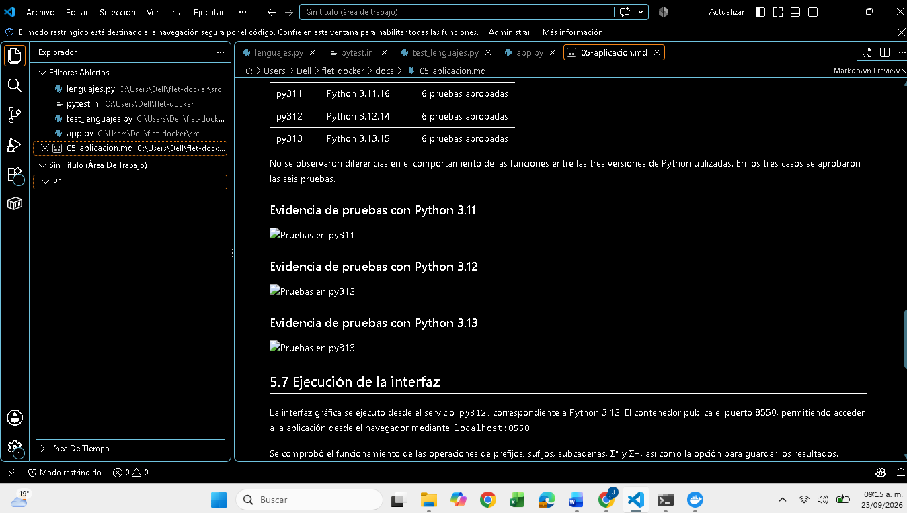
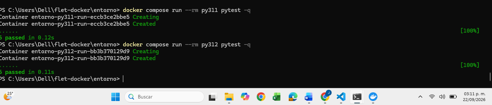
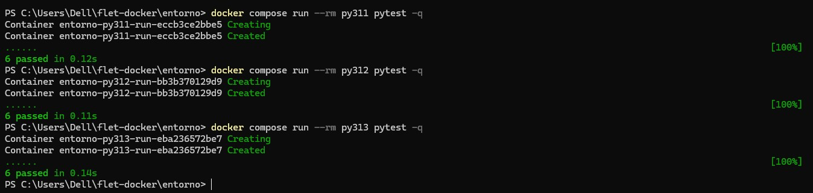
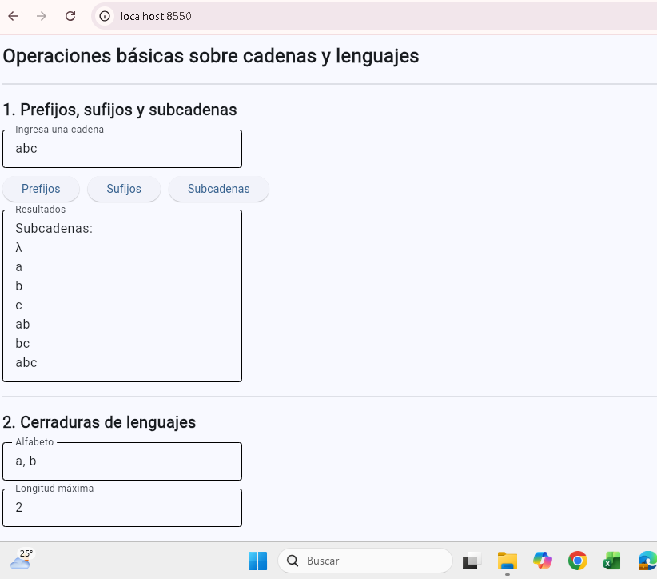

# Ejercicio 5. Aplicación con interfaz gráfica

## 5.1 Objetivo

En este ejercicio se desarrolló una aplicación en Python utilizando Flet para realizar operaciones básicas sobre cadenas y lenguajes. La aplicación permite calcular prefijos, sufijos y subcadenas de una cadena, así como la cerradura de Kleene (Σ*) y la cerradura positiva (Σ+) de un alfabeto hasta una longitud máxima indicada por el usuario.

La aplicación fue diseñada separando la lógica de las operaciones de la interfaz gráfica. De esta manera, las funciones pueden probarse de forma independiente mediante pruebas automatizadas.

## 5.2 Estructura de la aplicación

El programa se dividió principalmente en dos archivos:

* `src/lenguajes.py`: contiene las funciones que realizan las operaciones sobre cadenas y lenguajes.
* `src/app.py`: contiene la interfaz gráfica desarrollada con Flet y utiliza las funciones definidas en `lenguajes.py`.

Esta separación permite modificar la interfaz sin alterar las funciones principales y también facilita la realización de pruebas automatizadas.

## 5.3 Prefijos, sufijos y subcadenas

La primera parte de la aplicación permite introducir una cadena y calcular sus prefijos, sufijos y subcadenas.

Por ejemplo, para la cadena `abc`, los prefijos obtenidos son:

`λ, a, ab, abc`

Los sufijos son:

`abc, bc, c, λ`

En el programa se decidió incluir la cadena vacía, representada por `λ`, tanto en los prefijos como en los sufijos. Se adoptó esta convención porque la cadena vacía puede considerarse un prefijo y un sufijo de cualquier cadena.

Para una cadena de longitud `n` existen `n + 1` prefijos si se considera la cadena vacía.

Una cadena de longitud `n` puede tener como máximo:

`n(n + 1) / 2`

subcadenas no vacías distintas. Si también se considera la cadena vacía, el máximo es:

`n(n + 1) / 2 + 1`

Por ejemplo, para `abc` se obtienen las subcadenas:

`λ, a, b, c, ab, bc, abc`

## 5.4 Cerradura de Kleene y cerradura positiva

La segunda parte de la aplicación permite introducir un alfabeto y una longitud máxima para generar las cadenas correspondientes a Σ* y Σ+ hasta esa longitud.

Por ejemplo, utilizando el alfabeto:

`Σ = {a, b}`

y una longitud máxima de 2, se obtiene:

**Σ***:

`λ, a, b, aa, ab, ba, bb`

**Σ+**:

`a, b, aa, ab, ba, bb`

La diferencia principal observada es que Σ* contiene la cadena vacía `λ`, mientras que Σ+ comienza con las cadenas de longitud 1.

El número de cadenas posibles de una longitud determinada crece de acuerdo con `|Σ|^n`, donde `|Σ|` representa el número de símbolos del alfabeto y `n` la longitud de las cadenas. Debido a este crecimiento, una longitud grande puede producir una cantidad muy elevada de resultados.

Por este motivo, se agregó una validación para impedir operaciones que generen más de 200,000 cadenas. Cuando se supera este límite, el programa muestra un mensaje de error en lugar de generar todas las cadenas. Esto evita realizar una operación innecesariamente grande y permite observar de forma práctica el crecimiento de un lenguaje conforme aumenta la longitud de sus cadenas.

## 5.5 Exportación de resultados

La interfaz incluye la opción **Guardar resultados**. Al utilizarla, los resultados obtenidos se almacenan en un archivo llamado `resultados.txt`.

Esto permite conservar los resultados generados por las operaciones sin necesidad de copiarlos manualmente desde la interfaz.

## 5.6 Pruebas automatizadas

Se creó el archivo `tests/test_lenguajes.py` utilizando `pytest`. Se implementaron seis pruebas automatizadas que comprueban diferentes casos de las funciones desarrolladas.

Entre los casos probados se encuentran:

* La cadena vacía.
* Un alfabeto formado por un solo símbolo.
* Los prefijos y sufijos de una cadena de longitud 1.
* La diferencia entre Σ* y Σ+ cuando la longitud máxima es cero.
* La generación de subcadenas.
* El rechazo de una operación que supera el límite de 200,000 cadenas.

La misma suite de pruebas fue ejecutada en los tres contenedores definidos para la práctica.

| Servicio | Versión de Python | Resultado           |
| -------- | ----------------- | ------------------- |
| py311    | Python 3.11.16    | 6 pruebas aprobadas |
| py312    | Python 3.12.14    | 6 pruebas aprobadas |
| py313    | Python 3.13.15    | 6 pruebas aprobadas |

No se observaron diferencias en el comportamiento de las funciones entre las tres versiones de Python utilizadas. En los tres casos se aprobaron las seis pruebas.

### Evidencia de pruebas con Python 3.11

### Evidencia de pruebas con Python 3.12

### Evidencia de pruebas con Python 3.13

## 5.7 Ejecución de la interfaz

La interfaz gráfica se ejecutó desde el servicio `py312`, correspondiente a Python 3.12. El contenedor publica el puerto 8550, permitiendo acceder a la aplicación desde el navegador mediante `localhost:8550`.

Se comprobó el funcionamiento de las operaciones de prefijos, sufijos, subcadenas, Σ* y Σ+, así como la opción para guardar los resultados.

### Evidencia de la interfaz gráfica

## 5.8 Resultado

La aplicación permitió implementar las operaciones solicitadas separando la lógica del programa de la interfaz gráfica. Las pruebas automatizadas fueron aprobadas utilizando Python 3.11, Python 3.12 y Python 3.13, por lo que no se encontraron diferencias de comportamiento entre las tres versiones utilizadas.
